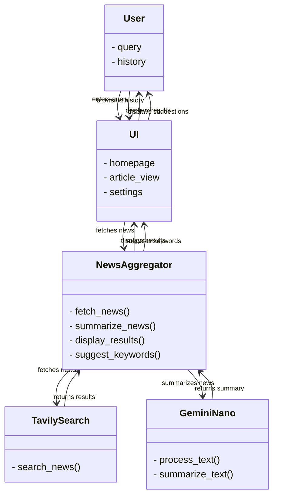

# 🌈 NanoNews - Your AI-Powered News Hub 📲

**Bringing you a world of news, personalized to your interests with AI!** NanoNews uses **Gemini Nano** to intelligently summarize articles and tailor recommendations just for you. Get ready for a news experience like never before!

---

### ✨ Features

🌍 **Personalized News Feed**  
_Stay informed with articles that match your interests and reading habits._

📰 **Quick Summaries**  
_Grab the key points of any article in seconds, without losing important context._

⚖️ **Bias Detection**  
_We analyze articles for bias, providing balanced views to broaden your perspective._

💬 **Smart Q&A**  
_Ask specific questions and get clear, concise answers directly from the news._

🤖 **Adaptive Learning**  
_Our AI learns from your interactions, making your feed smarter with every click._

---

## 🖥️ Tech Stack

- **Frontend**: HTML, CSS, JavaScript
- **Backend**: Vanilla JavaScript
- **AI**: Powered by Gemini Nano for NLP and Summarization
- **Search API**: Tavily Search for high-speed news retrieval
- **Database**: Appwrite - fast and scalable

---

### 🎉 Getting Started

1. **Clone the Repo:**
   ```bash
   git clone <Your Repo URL Here>
   ```
2. **Load as Unpacked Extension:**
   - Open your browser, go to `chrome://extensions/`.
   - Enable **Developer mode**.
   - Click **Load unpacked** and select the cloned repo's root directory.

---

### 🎈 Future Plans

🧠 **Advanced Topic Modeling**: Smarter recommendations with next-gen topic analysis.  
🎭 **Sentiment Detection**: Track article sentiment to avoid bias.  
📲 **Real-time News Alerts**: Get breaking news at your fingertips.  
📚 **Offline Reading**: Save articles to enjoy anytime, anywhere!  
♿ **Accessibility**: Making NanoNews accessible for everyone.

---

## 🎨 Visual Overview

### **App Flow:**


---

## 🎉 Contribute to NanoNews!

We love collaborating! If you have ideas, fork this project, make some magic happen, and submit a pull request. Every contribution is appreciated and helps make NanoNews the go-to personalized news experience!  

## 📝 License

MIT License. Your code, your terms!

---

### Search only for what you want to know with **NanoNews**! 🎉
