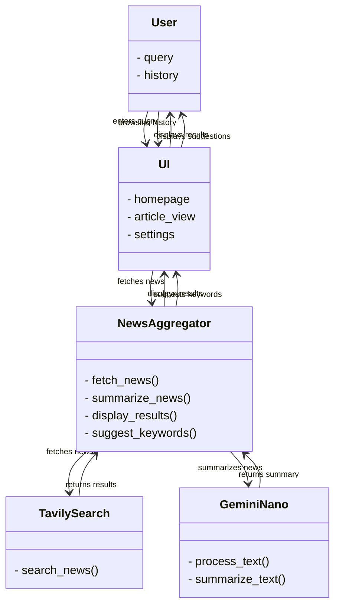

# NanoNews
**AI-Powered News Aggregator**  A personalized news aggregator that leverages Gemini Nano for intelligent article summarization and personalized recommendations. 

# AI-Powered News Aggregator

**Overview**

This project aims to create a powerful and personalized news aggregator using advanced AI technologies. By leveraging the capabilities of Gemini Nano and a robust search API like Tavily Search, we aim to deliver a superior news reading experience.

**Key Features:**

* **Personalized News Feed:** Tailored to individual preferences and interests.
* **In-Depth Summaries:** Quickly grasp the essence of complex articles.
* **Bias Detection and Mitigation:** Identify biased content and provide balanced perspectives.
* **Intelligent Question-Answering:** Ask specific questions about the news and receive accurate answers.
* **Continuous Learning and Adaptation:** Our AI model learns from user interactions to improve its recommendations over time.

**Technical Stack:**

* **Frontend:** HTML, CSS, and JavaScript
* **Backend:** Vanilla Javascript
* **AI:** Gemini Nano for natural language processing and summarization.
* **Search API:** Tavily Search for efficient news article retrieval.
* **Database:** Appwrite for fast and scalable data storage.

**Getting Started:**

1. **Clone the Repository:**
   ```bash
   git clone [invalid URL removed]
2. **Load as Unpacked Extension:**
Open Chrome (or your preferred browser) and go to chrome://extensions/ (or equivalent for other browsers).
Enable "Developer mode".
Click "Load unpacked".
Select the root directory of the cloned repository.

3. **Future Improvements:**

Advanced Topic Modeling: Implement more sophisticated topic modeling techniques to improve personalized recommendations.
Sentiment Analysis: Analyze the sentiment of news articles to identify biased or opinionated content.
Real-time News Alerts: Notify users of breaking news and important updates.
Offline Reading: Allow users to save articles for offline reading.
Accessibility: Ensure the application is accessible to users with disabilities.
4. **Contributing:** 
Contributions to this project are welcome. Please feel free to fork the repository and submit pull requests.

**License:**

This project is licensed under the MIT License.
